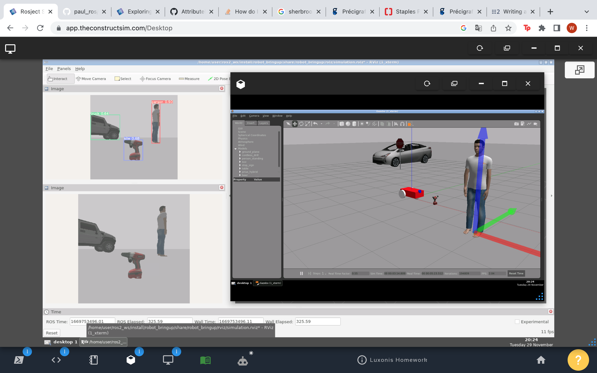

# luxonis-ros2-homework
ROS2 workspace for Luxonis' homework of a simple robot with object detection.

This project was tested with ROS2 Humble with Ubuntu 22.04. It was inspired by the project available [here](https://www.youtube.com/watch?v=594Gmkdo-_s).

## Installation

Clone the repository in a ROS 2 workspace.

```bash
cd ~/
mkdir -p ros2_ws/src/
cd ros2_ws/src/
git clone git@github.com:babindemers/luxonis-ros2-homework.git
```

Install the required packages for YoloV5. Torch is required with a specific to be compatible with the script.

```bash
pip3 install tqdm seaborn pandas torchvision torch IPython
```

Install the required ROS packages.

```bash
rosdep install --from-paths src --ignore-src -r -y
```

Build the project.

```bash
colcon build
```

Source the packages.

```bash
source install/setup.bash
```

## Usage

In a first terminal, start the simulation.

```bash
ros2 launch robot_bringup simulation.launch.py
```

In a second terminal, launch the YoloV5 node.

```bash
cd ~/ros2_ws/src/luxonis-ros2-homework/robot_recognition/scripts/
python3 ros_recognition_yolo.py
```

You should now see the detected objects in RViz. You can either move the robot with your keyboard, or move the models in the Gazebo simulation.

